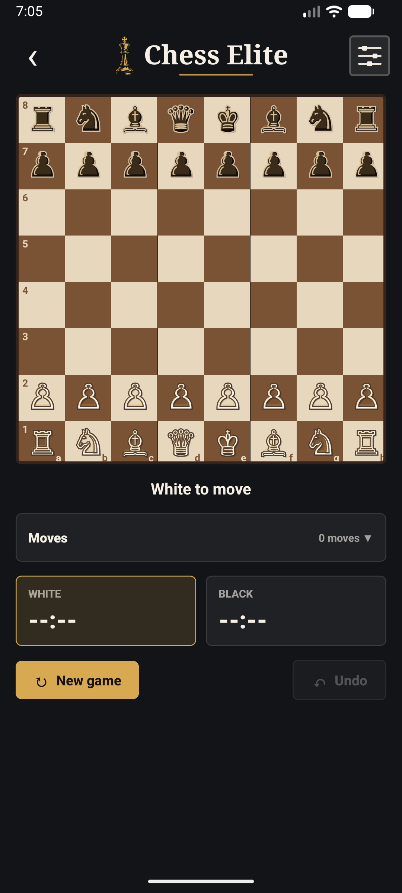

# Chess Elite

Application mobile Android d'echecs developpee avec Expo, React Native et TypeScript.

L'objectif est de proposer un jeu local simple et agreable, avec un plateau fonctionnel, des regles d'echecs fiables, des themes visuels, des skins de pieces et une experience mobile polie.

## Apercu



## Etat du projet

La premiere version Android est fonctionnelle et installee via APK sur telephone.

Statut actuel :

- App Expo / React Native creee dans `ChessElite`.
- Echiquier 8x8 responsive.
- Pieces affichees depuis la position officielle.
- Regles gerees par `chess.js`.
- Selection, coups legaux, captures et changement de tour.
- Detection de l'echec, echec et mat, pat et fin de partie.
- Promotion geree.
- Nouvelle partie.
- Historique des coups affiche en notation SAN.
- Annulation du dernier coup avec restauration du plateau, de l'historique et du chrono.
- Chronometre local avec modes No limit, 5 min et 10 min.
- IA noire avec 10 niveaux de difficulte, du niveau 1 simple au niveau 10 plus fort.
- Animations de deplacement des pieces sur le plateau.
- Themes de plateau : Classic, Dark, Neon, Gaming.
- Skins de pieces : Classic, Pixel, Medieval, Future, Cartoon et palettes premium V1.6.
- Skins premium locaux : Marble Gold, Obsidian, Tournament Green, Ivory Royal, Midnight Blue.
- Sauvegarde des preferences avec AsyncStorage.
- Ecran d'accueil allege avec choix solo contre IA, 2 joueurs, acces Skins et Stats.
- Transition animee noir et or entre l'accueil et le plateau, sans rechargement visible de la home.
- Ecran de jeu simplifie avec actions principales visibles, progression ouverte depuis le header, reglages ouverts depuis la roue crantee et historique replie dans `Moves`.
- Navigation contextuelle : `Skins` et `Stats` reviennent vers la home ou vers la partie en cours selon leur point d'ouverture.
- Ecran de fin de partie anime avec statistiques de progression et etat de sauvegarde corrige.
- APK Android genere, installe et valide sur emulateur puis telephone.

## Stack

- Expo `~56.0.19`
- React Native `0.85.3`
- React `19.2.3`
- TypeScript
- `chess.js` pour les regles d'echecs
- `react-native-svg` pour les pieces
- `@react-native-async-storage/async-storage` pour les preferences
- `expo-splash-screen` pour le splash natif
- `expo-audio` pour les sons
- `expo-haptics` pour les vibrations

Note : `expo-haptics` est fixe en version `56.0.2`, car la version `56.0.3` disponible sur npm posait probleme avec son point d'entree JavaScript.

## Structure

```txt
chess
|-- todo.txt
`-- ChessElite
    |-- README.md
    |-- App.tsx
    |-- app.json
    |-- package.json
    |-- version.json
    |-- assets
    |   |-- icon.png
    |   |-- android-icon-foreground.png
    |   |-- android-icon-background.png
    |   |-- android-icon-monochrome.png
    |   |-- screenshots
    |   |   `-- chess-elite-board-portrait.png
    |   |-- sounds
    |   |   |-- move.wav
    |   |   `-- capture.wav
    |   `-- splash
    |       `-- chess-elite-splash.png
    |-- scripts
    |   `-- version.js
    `-- src
        |-- components
        |   |-- ChessBoard.tsx
        |   |-- ChessPiece.tsx
        |   `-- ChessSquare.tsx
        |-- config
        |   `-- appVersion.ts
        |-- game
        |   |-- ai.ts
        |   `-- engine.ts
        |-- i18n
        |   `-- translations.ts
        |-- progress
        |   `-- badges.ts
        |-- screens
        |   |-- HomeScreen.tsx
        |   |-- BoardScreen.tsx
        |   |-- GamesScreen.tsx
        |   |-- SkinsScreen.tsx
        |   `-- StatsScreen.tsx
        |-- skins
        |   |-- chessSkins.ts
        |   |-- pieceSkins.ts
        |   `-- skinUnlocks.ts
        |-- storage
        |   |-- playerProgress.ts
        |   `-- userPreferences.ts
        |-- themes
        |   `-- boardThemes.ts
        `-- utils
            `-- coordinates.ts
```

## Lancement en developpement

Depuis la racine du projet :

```powershell
cd ChessElite
npm install
npm start
```

Lancer sur Android :

```powershell
cd ChessElite
npm run android
```

Verifier TypeScript :

```powershell
cd ChessElite
npx tsc --noEmit
```

Mode online en local :

```powershell
Copy-Item .env.expo.example .env.expo
# Modifier .env.expo avec l'IP locale du PC qui lance ChessEliteBackend.
npm run start:expo
```

Sur emulateur Android, `http://10.0.2.2:3000` pointe vers le PC hote. Sur telephone physique, utiliser l'adresse IP locale du PC qui lance `ChessEliteBackend`.

Mode online avec le backend de production :

```powershell
Copy-Item .env.production.example .env.production
# Modifier .env.production avec l'URL publique du backend Railway.
npm run start:production
```

Important : les fichiers `.env.expo` et `.env.production` sont ignores par Git. Les builds APK/AAB doivent etre lances avec les scripts `:production` pour que `EXPO_PUBLIC_CHESS_ELITE_API_URL` soit bien injectee dans le bundle mobile.

Les scripts `:production` forcent les taches Release avec `--rerun-tasks` avant de generer l'artefact. C'est volontaire : les variables `EXPO_PUBLIC_*` sont integrees dans le bundle JavaScript au moment du build, et un build Gradle incremental peut sinon reutiliser un artefact precedent.

Test online avec un seul telephone :

1. Demarrer `ChessEliteBackend` sur le PC.
2. Lancer l'app sur le telephone avec `EXPO_PUBLIC_CHESS_ELITE_API_URL` qui pointe vers l'IP locale du PC.
3. Creer une partie online sur le telephone et noter le code.
4. Simuler le deuxieme joueur depuis PowerShell avec les endpoints REST du backend.
5. Jouer les blancs sur le telephone, puis jouer les noirs depuis PowerShell.
6. Couper/reouvrir l'app pour verifier la reprise automatique de la partie active.

Verifier les dependances Expo :

```powershell
cd ChessElite
npx expo install --check
```

## Build Android

APK de test deja valide :

```txt
ChessElite/android/app/build/outputs/apk/release/app-release.apk
```

Pour regenerer un APK :

```powershell
cd ChessElite
npm run android:apk
```

Pour regenerer un APK connecte au backend de production :

```powershell
cd ChessElite
npm run android:apk:production
```

Fichier APK genere :

```txt
ChessElite/android/app/build/outputs/apk/release/app-release.apk
```

Bundle Play Store signe :

```powershell
cd ChessElite
npm run android:aab
```

Bundle Play Store signe connecte au backend de production :

```powershell
cd ChessElite
npm run android:aab:production
```

Fichier `.aab` a envoyer dans la Play Console :

```txt
ChessElite/android/app/build/outputs/bundle/release/app-release.aab
```

Installer l'APK sur un appareil Android connecte :

```powershell
adb install -r app\build\outputs\apk\release\app-release.apk
```

Package Android :

```txt
com.antoine.chesselite
```

Important : pour le Play Store, utiliser le fichier `.aab` signe plutot que l'APK de test.

## Signature Android

La release Android utilise une cle d'upload locale et un fichier de proprietes de signature.

Ces fichiers ne doivent jamais etre publies sur GitHub. Ils sont ignores par la configuration Git, car ils contiennent la cle de signature et les mots de passe.

Tres important : faire une sauvegarde privee de ces deux fichiers. Ils permettent de signer les prochaines versions envoyees au Play Store. Sans cette cle d'upload, il faudra demander une reinitialisation de cle dans la Play Console.

La configuration Gradle lit automatiquement `signing.properties` si le fichier existe. Si le fichier est absent, Gradle retombe sur la cle debug pour les builds locaux, mais ce n'est pas utilisable pour publier.

## Version Android

La version de l'application est centralisee dans :

```txt
ChessElite/version.json
```

Ce fichier contient :

- `versionName` : version visible par l'utilisateur, par exemple `1.0.5`.
- `versionCode` : numero interne Android / Play Store, toujours croissant.

Gradle lit automatiquement ces valeurs pour les builds APK et AAB. Il ne faut donc plus modifier `versionCode` ou `versionName` directement dans `android/app/build.gradle`.

L'application lit aussi ce fichier pour afficher la version discretement dans la modale `Settings`.

Avant une nouvelle publication, incrementer la version depuis `ChessElite` :

```powershell
npm run version:patch
```

Autres increments disponibles :

```powershell
npm run version:minor
npm run version:major
```

Le script met a jour `version.json`, `package.json`, `package-lock.json` et `app.json`.

## Publication Play Store

Etapes restantes dans Google Play Console :

1. Creer l'application `Chess Elite` avec le package `com.antoine.chesselite`.
2. Activer Play App Signing si Google le propose.
3. Televerser `app-release.aab` dans une piste de test interne.
4. Completer la fiche Play Store : descriptions, categorie, icone, screenshots, classification age.
5. Completer les formulaires : securite des donnees, publicite, audience cible, contenu.
6. Installer la version depuis la piste interne et verifier lancement, icone, splash, partie locale, IA, historique, chrono et persistence.
7. Promouvoir ensuite la release vers production.

Le dossier de preparation de la fiche Play Store est disponible ici :

```txt
PlayStore/
```

## Icone Android

L'icone principale Expo est declaree ici :

```json
"icon": "./assets/icon.png"
```

Sur Android, l'icone du launcher utilise surtout l'adaptive icon :

```json
"android": {
  "adaptiveIcon": {
    "foregroundImage": "./assets/android-icon-foreground.png",
    "backgroundImage": "./assets/android-icon-background.png",
    "monochromeImage": "./assets/android-icon-monochrome.png"
  }
}
```

Les assets adaptatifs Android suivent la charte Chess Elite : fond noir texture, medaillon roi dore et version monochrome pour les icones thematiques Android.

Comme le dossier natif `android/` existe deja, l'APK utilise aussi les ressources generees dans `android/app/src/main/res/mipmap-*`. Ces fichiers `ic_launcher*.png` doivent rester synchronises avec les assets Expo quand l'icone change.

Quand l'icone change, il faut regenerer puis reinstaller l'APK. Remplacer seulement l'image ne met pas a jour une application deja installee.

## Synthese des etapes

| Etape | Sujet | Statut |
|---|---|---|
| 1 | Initialisation Expo / Android | Validee |
| 2 | Echiquier statique | Validee |
| 3 | Pieces et position initiale | Validee |
| 4 | Selection, coups legaux et deplacement | Validee |
| 5 | Etats de partie et nouvelle partie | Validee |
| 6 | Themes de plateau | Validee |
| 7 | Skins de pieces | Validee |
| 8 | Sauvegarde des preferences | Validee |
| 9 | UX, accueil, sons et vibrations | Validee |
| 10 | Build APK et test Android | Validee sur emulateur et telephone |
| V2.1 | Historique des coups | Validee sur emulateur Android |
| V2.2 | Chronometre | Validee sur emulateur Android |
| V2.3 | Annuler le dernier coup | Validee sur emulateur Android |
| V2.4 | IA 10 niveaux | Validee sur emulateur Android |
| V2.5 | Animations de deplacement | Validee sur emulateur Android |
| V2.6 | Accueil avec choix local / IA | Validee sur emulateur Android |
| V2.7 | Transition animee accueil vers plateau | Validee sur emulateur Android |
| V2.8 | Ergonomie de l'ecran de jeu | Validee TypeScript |

## Roadmap V1.1 - Progression & Skins

Objectif produit : rendre Chess Elite plus vivant et donner au joueur une raison de relancer l'application apres une premiere partie.

La V1.1 doit rester locale et simple. Elle ne doit pas introduire de backend, de compte utilisateur, de mode online ou d'achats integres. Le coeur de cette version est :

- progression personnelle,
- statistiques locales,
- XP et niveaux,
- skins a debloquer,
- defis quotidiens,
- ecran de fin de partie plus riche,
- polish UX et animations.

Boucle attendue :

```txt
Je lance l'app.
Je vois mon niveau et mon defi du jour.
Je joue une partie.
Je gagne de l'XP.
Je progresse vers un skin.
J'ai envie de rejouer.
```

### Perimetre V1.1

Must have :

- ecran `Skins`,
- selection et sauvegarde locale du skin actif,
- conditions de deblocage des skins,
- statistiques locales,
- XP simple,
- niveaux de joueur,
- ecran de fin de partie enrichi,
- corrections des bugs identifies pendant les tests.

Should have :

- 3 defis quotidiens,
- barre de progression XP,
- badges simples,
- animations victoire / defaite plus informatives,
- messages de progression apres partie.

Could have :

- historique des 10 dernieres parties,
- phrases motivantes apres victoire ou defaite,
- statistiques par mode de jeu,
- indication du prochain skin proche du deblocage.

Won't have en V1.1 :

- mode online,
- matchmaking,
- compte utilisateur,
- classement global,
- chat,
- publicites,
- achats integres,
- sauvegarde cloud,
- version iOS,
- moteur d'analyse avance.

### Etape 1 - Fondations de progression

Objectif : creer le modele local qui permettra de suivre les stats, l'XP, les niveaux et les deblocages.

Travail :

- creer un stockage `PlayerProgress` dans AsyncStorage,
- charger la progression au lancement,
- sauvegarder la progression apres chaque fin de partie,
- centraliser les fonctions de calcul XP / niveaux,
- ajouter une couche de migration simple pour les futures versions.

Modele cible :

```ts
type PlayerProgress = {
  gamesPlayed: number;
  wins: number;
  losses: number;
  checks: number;
  checkmates: number;
  currentWinStreak: number;
  bestWinStreak: number;
  xp: number;
  level: number;
  selectedSkinId: string;
  unlockedSkinIds: string[];
  completedDailyChallengeIds: string[];
  dailyChallengeProgress: Record<string, number>;
  lastChallengeDate: string;
  distinctPlayDates: string[];
};
```

Criteres d'acceptation :

- une partie terminee incremente `gamesPlayed`,
- une victoire incremente `wins`,
- une defaite incremente `losses`,
- les series de victoires sont mises a jour,
- l'XP et le niveau sont sauvegardes,
- les donnees persistent apres fermeture / relance.

### Etape 2 - XP et niveaux

Objectif : donner une progression visible, meme sans compte utilisateur.

Regles initiales :

```txt
Jouer une partie : +5 XP
Gagner une partie : +20 XP
Faire echec et mat : +30 XP
Terminer un defi : +10 XP ou plus selon le defi
```

Niveaux proposes :

```txt
Niveau 1 - Debutant
Niveau 2 - Apprenti
Niveau 3 - Stratege
Niveau 4 - Maitre
Niveau 5 - Elite
```

Criteres d'acceptation :

- l'XP augmente apres une partie,
- une victoire rapporte plus qu'une defaite,
- un echec et mat donne un bonus,
- le niveau est recalcule depuis l'XP,
- l'accueil affiche le niveau et la progression vers le niveau suivant.

### Etape 3 - Skins et deblocage

Objectif : faire de la personnalisation le moteur principal de retention.

Skins recommandes pour V1.1 :

| Skin | Statut initial | Condition |
|---|---|---|
| Classic | Gratuit | Disponible au lancement |
| Dark Elite | Gratuit | Disponible au lancement |
| Wood Premium | Gratuit | Disponible au lancement |
| Neon Blue | Bloque | Gagner 3 parties |
| Royal Gold | Bloque | Jouer 10 parties |
| Ice | Bloque | Atteindre le niveau 3 |
| Fire | Bloque | Faire echec et mat |
| Cyber | Bloque | Jouer 3 jours differents |

Configuration cible :

```ts
type ChessSkin = {
  id: string;
  name: string;
  description: string;
  boardThemeId: string;
  pieceSkinId: string;
  unlockCondition: {
    type: 'free' | 'wins' | 'gamesPlayed' | 'level' | 'checkmates' | 'distinctDays';
    value?: number;
  };
};
```

Criteres d'acceptation :

- au moins 6 skins sont disponibles dans la configuration,
- un skin bloque affiche sa condition,
- un skin bloque ne peut pas etre selectionne,
- un skin debloque peut etre selectionne,
- le skin selectionne modifie le plateau et les pieces,
- le skin choisi reste actif apres relance.

### Etape 4 - Ecran Skins

Objectif : permettre au joueur de voir, choisir et debloquer ses styles.

Contenu attendu :

```txt
Skins

Classic
Disponible - Selectionne

Dark Elite
Disponible - Choisir

Neon Blue
Bloque - Gagne 3 parties pour debloquer

Royal Gold
Bloque - Joue 10 parties pour debloquer
```

Chaque carte de skin doit afficher :

- un apercu du plateau,
- un apercu des pieces,
- le statut `Selectionne`, `Choisir` ou `Bloque`,
- la condition de deblocage,
- un retour visuel quand un skin vient d'etre debloque.

Criteres d'acceptation :

- l'ecran est accessible depuis la home,
- la selection d'un skin met a jour le jeu,
- les skins bloques restent visibles mais inactifs,
- l'etat est coherent en portrait et paysage.

### Etape 5 - Statistiques locales

Objectif : donner au joueur un profil local et une sensation de progression.

Statistiques a afficher :

```txt
Parties jouees
Victoires
Defaites
Taux de victoire
Meilleure serie
Serie actuelle
Echecs realises
Echecs et mats
Skin le plus utilise
```

Criteres d'acceptation :

- les stats sont visibles depuis un ecran dedie,
- le taux de victoire est calcule automatiquement,
- les series sont exactes apres victoire / defaite,
- l'ecran affiche une phrase de progression, par exemple le prochain skin proche du deblocage.

### Etape 6 - Defis quotidiens

Objectif : creer une petite raison de revenir chaque jour sans backend.

Version simple :

```txt
Defi 1 : Joue une partie
Defi 2 : Gagne une partie
Defi 3 : Fais echec au roi adverse
```

Types de defis possibles :

```ts
type DailyChallenge = {
  id: string;
  title: string;
  description: string;
  rewardXp: number;
  type: 'play_game' | 'win_game' | 'check' | 'checkmate' | 'capture_queen';
  target: number;
};
```

Criteres d'acceptation :

- 3 defis sont affiches chaque jour,
- un defi termine donne son XP une seule fois,
- les defis sont sauvegardes localement,
- les defis se reinitialisent selon la date locale,
- l'ecran de fin de partie mentionne les defis termines.

### Etape 7 - Home V1.1

Objectif : transformer la home en tableau de bord simple.

Adaptation UX actuelle : la home reste volontairement legere. Elle affiche l'identite Chess Elite, le niveau / XP en version compacte, les boutons `Solo vs AI` et `2 players`, puis les acces `Skins` et `Stats`. Les details de progression, statistiques rapides, skin actif et defis quotidiens sont regroupes dans une modale `Progression` depuis le header de la vue plateau. Quand `Skins` ou `Stats` sont ouverts depuis une partie, le retour ramene sur le plateau et la partie reste montee en arriere-plan.

Contenu cible :

```txt
Chess Elite

Niveau 3 - Stratege
120 / 200 XP

Jouer
Defis
Skins
Statistiques
Parametres

Defi du jour : Gagne une partie avec les blancs
Skin actuel : Dark Elite
Serie actuelle : 2 victoires
```

Criteres d'acceptation :

- l'utilisateur peut toujours lancer rapidement une partie,
- le choix `2 joueurs` / `Solo vs AI` reste clair,
- la home affiche XP, niveau, serie actuelle et prochain objectif,
- les boutons sont ergonomiques en portrait et paysage.

### Etape 8 - Fin de partie enrichie

Objectif : rendre la fin de partie utile, motivante et informative.

En cas de victoire :

```txt
Victoire !

+20 XP
Defi termine : Gagne une partie
Parties jouees : 12
Victoires : 8
Taux de victoire : 67 %
Serie actuelle : 3 victoires

Nouveau skin bientot debloque :
Neon Blue - 2 / 3 victoires

Rejouer
```

En cas de defaite :

```txt
Defaite

+5 XP pour la partie jouee
Tu progresses quand meme.

Parties jouees : 12
Victoires : 8
Taux de victoire : 67 %
Serie actuelle : 0

Rejouer
```

Criteres d'acceptation :

- l'overlay affiche victoire ou defaite,
- l'XP gagnee est visible,
- les defis termines sont visibles,
- les skins debloques sont visibles,
- des statistiques utiles sont visibles directement dans l'overlay,
- le joueur peut rejouer directement,
- l'overlay ne reste jamais bloque sur un message de sauvegarde.

### Etape 9 - Polish et tests

Objectif : stabiliser la V1.1 avant APK / test interne.

Travail :

- verifier toutes les langues,
- verifier portrait et paysage,
- verifier la persistence apres fermeture,
- verifier les skins bloques / debloques,
- verifier l'XP apres victoire, defaite, echec et mat,
- verifier les defis sur deux dates differentes,
- verifier les animations victoire / defaite,
- corriger les bugs testeurs.

Criteres d'acceptation :

- `npx tsc --noEmit` passe,
- `npx expo install --check` passe ou les ecarts sont documentes,
- APK installe sur emulateur,
- APK installe sur telephone,
- une partie complete met correctement a jour stats, XP, defis et skins.

Validation en cours :

- `npx tsc --noEmit` : OK.
- `npx expo install --check` : OK apres mise a jour de `expo` vers `~56.0.19`, `expo-audio` vers `~56.0.13` et `expo-splash-screen` vers `~56.0.14`.
- `npm run android:apk` : OK, APK release genere.
- Apres wipe data et relance de l'emulateur : `adb install -r android\app\build\outputs\apk\release\app-release.apk` OK.
- Accueil portrait : OK, progression V1.1 et boutons principaux visibles.
- Accueil paysage : OK apres correction, boutons `2 joueurs` et `Solo vs IA` alignes en bas sur une meme ligne.
- Plateau portrait : OK, plateau, historique, horloge et actions visibles.
- Plateau paysage : OK, plateau agrandi a gauche, header et controles a droite.
- Persistance locale : OK sur les preferences, changement de langue vers francais conserve apres fermeture forcee et relance.
- Test utilisateur recent : partie complete OK, stats, XP, defis et overlay de fin de partie valides dans l'application.

### Tickets V1.1

| Ticket | Sujet | Priorite | Statut |
|---|---|---|---|
| 1.1.1 | Modele `PlayerProgress` et stockage local | Must | Validee TypeScript |
| 1.1.2 | Calcul XP, niveaux et progression | Must | Validee TypeScript |
| 1.1.3 | Mise a jour stats apres fin de partie | Must | Validee TypeScript |
| 1.1.4 | Configuration des skins V1.1 | Must | Validee TypeScript |
| 1.1.5 | Conditions de deblocage des skins | Must | Validee TypeScript |
| 1.1.6 | Ecran `Skins` | Must | Validee TypeScript |
| 1.1.7 | Ecran `Statistiques` | Must | Validee TypeScript |
| 1.1.8 | Defis quotidiens locaux | Should | Validee TypeScript |
| 1.1.9 | Home V1.1 avec progression | Should | Validee TypeScript |
| 1.1.10 | Overlay fin de partie enrichi | Must | Validee TypeScript |
| 1.1.11 | Tests portrait / paysage / persistence | Must | Validee utilisateur |
| 1.1.12 | Build APK puis AAB V1.1 | Must | APK release OK, AAB a faire |

## Fonctionnalites MVP validees

- Deux joueurs peuvent jouer localement sur le meme appareil.
- L'accueil permet de lancer directement une partie locale ou une partie contre l'IA.
- En partie locale, le selecteur d'adversaire est masque pour garder l'ecran plus simple.
- L'ecran de jeu garde le plateau, les chronos, le statut et les actions principales visibles.
- Les reglages fonctionnels sont regroupes derriere la roue crantee du header.
- L'apparence du plateau et des pieces passe par l'ecran `Skins`, afin que les skins bloques ne puissent pas etre contournes depuis les settings.
- Les coups illegaux sont refuses.
- Les captures, echecs, mats, pats et promotions sont geres.
- L'historique des coups est affiche par paires blanc/noir.
- Le dernier coup peut etre annule.
- Le chronometre peut etre active en 5 min ou 10 min, ou desactive avec No limit.
- Un joueur peut affronter une IA noire reglable de 1 a 10.
- Les pieces glissent vers leur case d'arrivee pendant les coups joues.
- Le theme et le skin choisis sont conserves apres relance.
- L'application fonctionne sans serveur Metro dans un APK installe.

## Tests manuels utiles

Avant chaque APK important, verifier :

- lancement de l'app,
- splash screen et loader,
- navigation accueil vers partie locale,
- navigation accueil vers partie contre `AI 1`,
- transition noir et or visible entre l'accueil et le plateau,
- absence de flash/rechargement de l'accueil pendant cette transition,
- deplacement simple `e2 -> e4`,
- animation visible pendant le deplacement `e2 -> e4`,
- affichage de `e4` dans l'historique des coups,
- ouverture / fermeture du panneau `Moves`,
- ouverture / fermeture du panneau de reglages via la roue crantee du header,
- annulation de `e2 -> e4` avec retour du pion en `e2`,
- activation du mode chrono `5 min` et bascule du temps actif apres un coup,
- activation de `AI 1`, coup blanc `e2 -> e4`, reponse automatique noire, puis `Undo` pour annuler le tour complet blanc/noir,
- capture simple,
- changement de theme,
- changement de skin,
- ouverture de `Skins` depuis la home puis retour vers la home,
- ouverture de `Stats` depuis la home puis retour vers la home,
- ouverture de `Skins` depuis la modale `Progression` du plateau puis retour vers la partie en cours,
- ouverture de `Stats` depuis la modale `Progression` du plateau puis retour vers la partie en cours,
- fermeture puis relance pour valider la persistance,
- nouvelle partie,
- promotion,
- echec et mat, par exemple `f3 e5 g4 Qh4#`.

## Prochaines priorites

1. Generer l'AAB signe V1.1 pour Google Play.
2. Envoyer l'AAB sur une piste de test interne Google Play.
3. Installer la version de test interne et refaire le parcours critique complet.

## Notes techniques

- `chess.js` doit rester la source de verite pour les regles.
- L'interface ne doit pas recalculer les regles a la main.
- Les skins doivent modifier l'apparence des pieces sans changer leur forme generale ni leur logique.
- Les preferences utilisateur sont centralisees dans `src/storage/userPreferences.ts`.
- Les themes sont centralises dans `src/themes/boardThemes.ts`.
- Les skins de pieces sont centralises dans `src/skins/pieceSkins.ts`.
- Les presets premium et les conditions de deblocage sont centralises dans `src/skins/chessSkins.ts` et `src/skins/skinUnlocks.ts`.
